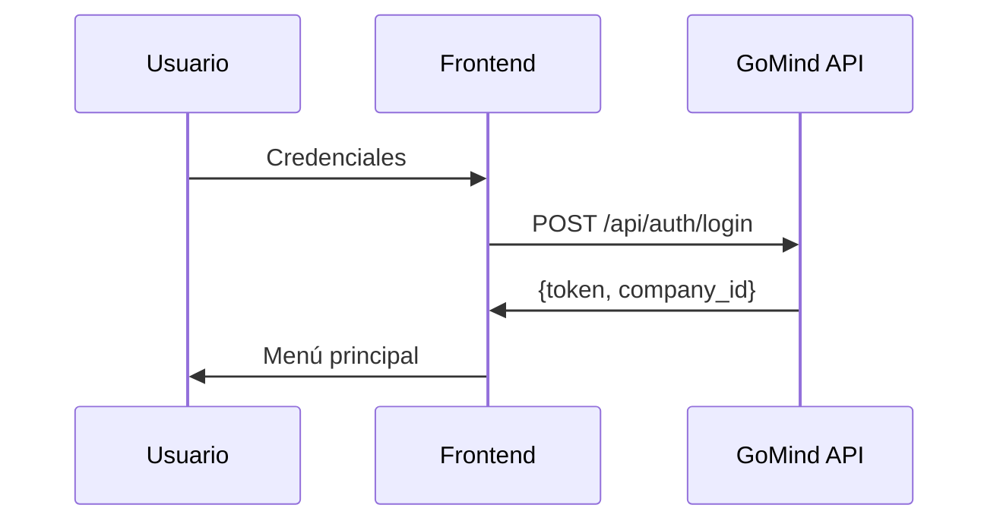
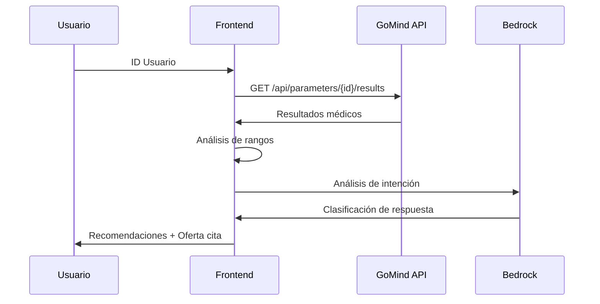
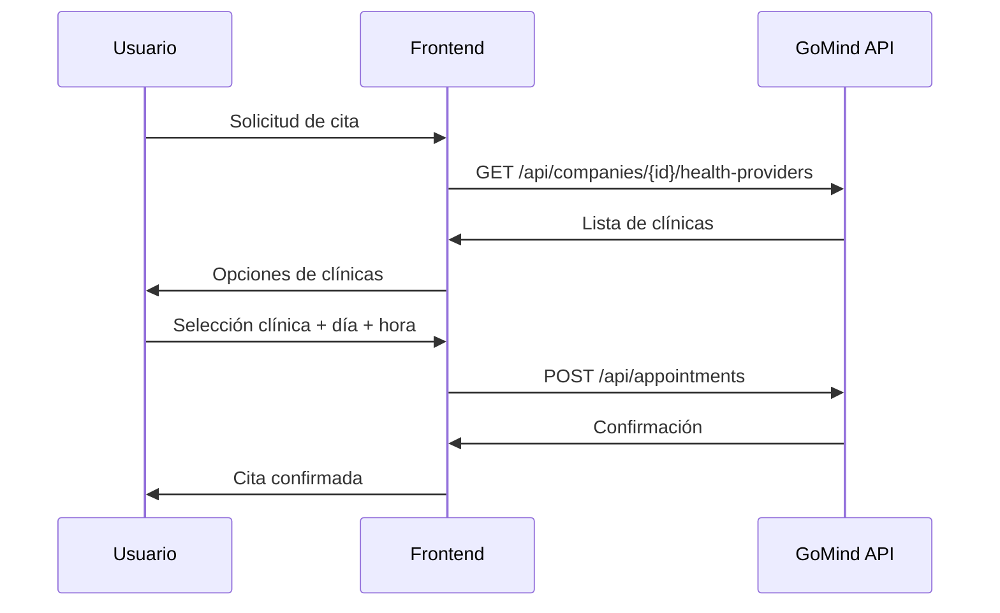

# Arquitectura Técnica - Bianca

## Visión General de la Arquitectura

Bianca está construida como una aplicación web conversacional que integra múltiples servicios para proporcionar asistencia médica inteligente.

## Componentes del Sistema

### 1. Frontend (Streamlit)

**Responsabilidades:**
- Interfaz de usuario conversacional
- Manejo de estado de sesión
- Renderizado de mensajes de chat
- Gestión de formularios de entrada

**Tecnologías:**
- Streamlit 1.50.0
- Session State para persistencia
- Chat interface nativa

### 2. Procesamiento de IA (AWS Bedrock)

**Modelo Utilizado:**
- `anthropic.claude-3-5-sonnet-20240620-v1:0`

**Funciones:**
- Análisis de intenciones de usuario
- Procesamiento de lenguaje natural
- Detección de despedidas
- Clasificación contextual de respuestas

**Configuración:**
```python
BEDROCK_MODEL_ID = "anthropic.claude-3-5-sonnet-20240620-v1:0"
BEDROCK_MAX_TOKENS = 1000
API_TIMEOUT = 30
```

### 3. Backend API (GoMind)

**Base URL:** `https://api-bianca-desa.gomind.cl`

**Endpoints Principales:**
- `/api/auth/login` - Autenticación
- `/api/parameters/{user_id}/results` - Resultados médicos
- `/api/companies/{company_id}/products` - Catálogo de productos
- `/api/companies/{company_id}/health-providers` - Proveedores de salud
- `/api/appointments` - Gestión de citas

## Flujo de Datos

### 1. Autenticación


### 2. Análisis Médico


### 3. Agendamiento de Citas


## Gestión de Estado

### Session State Variables

```python
# Autenticación
st.session_state.auth_token          # JWT token
st.session_state.company_id          # ID de empresa
st.session_state.user_data           # Datos del usuario

# Conversación
st.session_state.messages            # Historial de chat
st.session_state.stage               # Etapa actual del flujo

# Agendamiento
st.session_state.selected_clinic     # Clínica seleccionada
st.session_state.selected_day        # Día seleccionado
st.session_state.selected_time       # Hora seleccionada
st.session_state.clinics             # Lista de clínicas disponibles

# Productos
st.session_state.company_products    # Productos de la empresa
st.session_state.selected_product    # Producto seleccionado
```

## Análisis de Intenciones con IA

### Función Principal: `analyze_user_intent()`

**Entrada:**
- `user_message`: Mensaje del usuario
- `context_stage`: Contexto actual de la conversación

**Salida:**
- `POSITIVA`: Usuario acepta/confirma
- `NEGATIVA`: Usuario rechaza
- `AMBIGUA`: Respuesta no clara
- `PRODUCTOS`: Quiere ver productos
- `NUEVA_CITA`: Solicita nueva cita

**Prompt Template:**
```python
prompt = f"""Analiza la siguiente respuesta del usuario y determina su intención exacta.

Contexto: {context_desc}
Mensaje del usuario: "{user_message}"

Analiza si la intención es:
- POSITIVA: Quiere proceder, acepta, está de acuerdo
- NEGATIVA: No quiere proceder, rechaza claramente
- AMBIGUA: No está claro, necesita clarificación
- PRODUCTOS: Quiere ver productos o servicios disponibles
- NUEVA_CITA: Quiere agendar una nueva cita adicional

Responde ÚNICAMENTE con una de estas palabras: POSITIVA, NEGATIVA, AMBIGUA, PRODUCTOS, o NUEVA_CITA"""
```

## Análisis de Resultados Médicos

### Rangos de Referencia

```python
REFERENCE_RANGES = {
    'Colesterol Total': {'min': 0, 'max': 200, 'unit': 'mg/dL'},
    'Colesterol LDL': {'min': 0, 'max': 100, 'unit': 'mg/dL'},
    'Colesterol HDL': {'min': 40, 'max': float('inf'), 'unit': 'mg/dL'},
    'Triglicéridos': {'min': 0, 'max': 150, 'unit': 'mg/dL'},
    'Glicemia Basal': {'min': 70, 'max': 100, 'unit': 'mg/dL'},
    'Hemoglobina': {'min': 12, 'max': 16, 'unit': 'g/dL'},
    'Hematocrito': {'min': 36, 'max': 48, 'unit': '%'},
    'Recuento de Eritrocitos': {'min': 4.2, 'max': 5.4, 'unit': 'millones/μL'},
    'Recuento de Leucocitos': {'min': 4000, 'max': 11000, 'unit': '/μL'},
    'Plaquetas': {'min': 150000, 'max': 450000, 'unit': '/μL'}
}
```

### Lógica de Análisis

1. **Obtención de datos**: API call a `/api/parameters/{user_id}/results`
2. **Normalización**: Extracción de parámetros usando regex
3. **Comparación**: Valores vs rangos de referencia
4. **Clasificación**: Saludable vs requiere atención
5. **Recomendación**: Automática basada en resultados

## Manejo de Errores

### Estrategias de Fallback

1. **API Errors**: Mensajes user-friendly + retry logic
2. **Bedrock Errors**: Fallback a análisis por keywords
3. **Network Errors**: Timeout handling + error messages
4. **Data Validation**: Input sanitization + validation

### Códigos de Error Comunes

```python
# API Errors
200/201: Success
400: Bad Request - Datos inválidos
401: Unauthorized - Token inválido
404: Not Found - Recurso no encontrado
500: Internal Server Error - Error del servidor

# Bedrock Errors
- Model not available
- Rate limiting
- Invalid prompt format
```

## Optimizaciones de Performance

### 1. Caching
- Session state para datos de usuario
- Reutilización de tokens de autenticación
- Cache de productos y clínicas

### 2. Lazy Loading
- Carga de datos bajo demanda
- Inicialización diferida de componentes

### 3. Error Recovery
- Retry automático para fallos de red
- Fallback a funcionalidad básica

## Seguridad

### 1. Autenticación
- JWT tokens con expiración
- Validación de credenciales en cada request

### 2. Datos Sensibles
- Variables de entorno para credenciales
- No logging de información médica
- Sanitización de inputs

### 3. API Security
- HTTPS para todas las comunicaciones
- Timeout en requests para evitar hanging
- Validación de respuestas de API

## Escalabilidad

### Consideraciones Actuales
- Aplicación stateful (session state)
- Single-user por sesión
- Dependencia de servicios externos

### Mejoras Futuras
- Database para persistencia
- Load balancing
- Caching distribuido
- Microservicios architecture